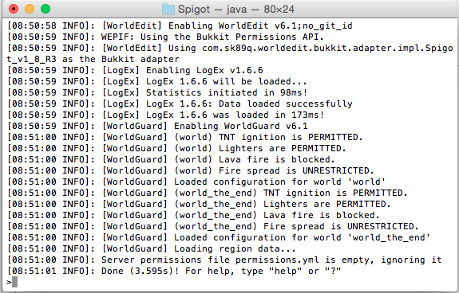
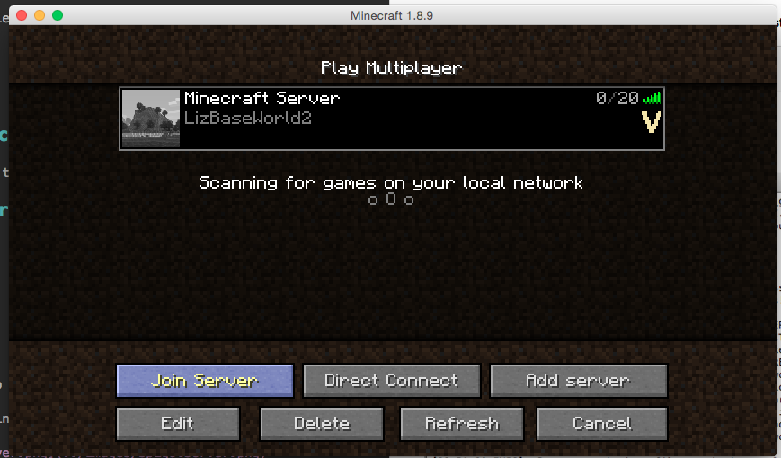

# Running the experiment

## Network the computers

Connect the computers to the same wi-fi/LAN network.

## Start the server

Open a command prompt, navigate to the spigot directory and start the spigot server:

```
cd ~/Spigot/
./runSpigot.sh
```

(wait for the world to load)

You should see something like this:



## Start minecraft

Start minecraft on both the player computers.  Make sure you select the Forge profile (see installation).

Choose multiplayer.

Click "Refresh".

Find the server "LizBaseWorld2" and click "join server":

.

### If you can't find the server

TODO

The server runs on port 25565.  You'll need to find the ip address of the server computer.  Let's say it's 192.168.0.5.  So the server address is:

`192.168.0.5:25565`

If you are running the server on the same computer as the player is playing minecraft, then you can use:

`\localhost:25565`


# Ending the experiment

## Stop the recording


## Debrief the participants

Give them the debrief form.  Thank them and answer any questions they have.  Show them out.

# Save the results

## Create results folder

## Copy the video files

## Copy the LogEx block log

Copy these two files into the results folder:

`Spigot/LogEx Database/logdata.ldb`
`Spigot/LogEx Database/playerdata.ldb`


## Finishing

Close minecraft.

Stop the server running.  Go to the command prompt and press `ctrl+c` or type `quit` to stop the server.  Wait for it to stop, then you can close the command prompt.
