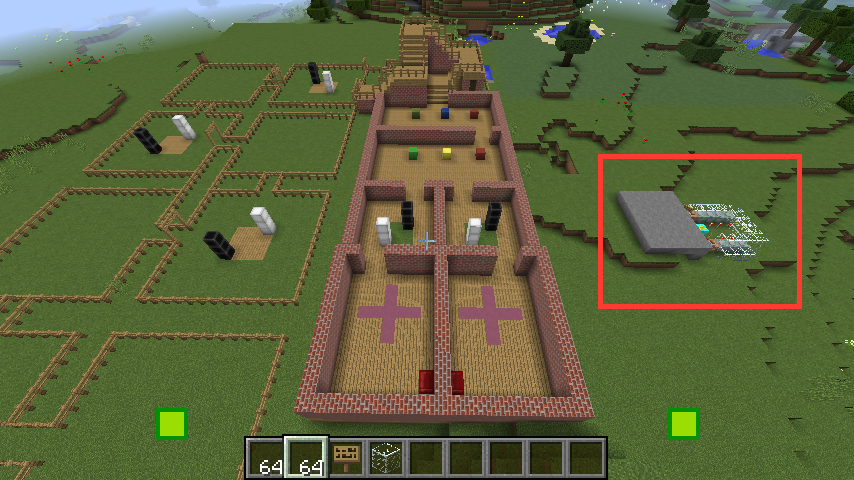

# Running the experiment
-----

# Before people come in:

## Prepare paperwork

Assign participant numbers in the format WaitA1, WaitB1 or NoWaitA1, NoWaitB1 etc.

-  Info sheets
-  Consent forms
-  Task instructions (Wait or NoWait condition)
-  Training center instructuions
-  Questionnaire 
-  Debriefing form
-  Payment form

Write the participant numbers on the questionnaires.

## Connect computers to power and turn on

## Network the computers

Connect the computers to the same wi-fi/LAN network.


## Start minecraft on computer A

Start minecraft on both the player computers.  Make sure you select the Forge profile version 1.11.2 (see installation).

Choose single player.

Choose the world "ExperimentWorld1".

The world will load.  Leave it for a few moments so that the world loads fully.

### Open the world to LAN

Press Escape, then choose "Open to LAN".

Make sure you choose **"Game Mode: Creative"** and **Cheats: On**, 

Then click "Start LAN World".

You will see a note at the bottom of the screen telling you the port number (a 5 digit number).  Note this down.  If you forget, go back to the game and hit the forward slash button to bring up the terminal - the number should be in the message history.

## Start minecraft on computer B

Start minecraft on both the player computers.  Make sure you select the Forge profile version 1.11.2 (see installation).

Choose **Multiplayer**.  Click "Direct connect" and enter the IP address of computer 1, followed by a colon, followed by the port number.  e.g.

`192.168.0.2:25565`

Click connect, and you should appear in the world next to the other player.


## Set the stage

### Clear the previous participants' blocks

Also remove mobs and cut grass.  Type the following:

`/clearblocks`    And then hit enter.

Check that the experiment area is clear and that all fences/gates etc. are correct.

### Give players blocks to place

Give players the right blocks and move them to the starting positions:  

Go to the big square of gray stone outside the training building (on the other side to the puzzle yards).  There are a set of command blocks set up to set the players in the right position with the right blocks:



Player A is on the right, player B is on the left (these are signposted).

Go up to the sign and **left click** the button on the side of the brown command block:


You should be transported to the right starting location and be given the right blocks.

If that doesn't work you can try typing the commands manually:

-  A gets green, orange

```
/clear @p
/give @p examplemod:greeninvisible 64
/give @p examplemod:orangeinvisible 64
/tp @p -42 73 -6
```

-  B gets red, blue

```
/clear @p
/give @p examplemod:redinvisible 64
/give @p examplemod:blueinvisible 64
/tp @p -42 73 -14
```

If these commands don't work, you can try the following:

-  Open the inventory by pressing 'e' (or 'i')
-  Click on the first tab at the top left (building blocks)
-  Scroll to the bottom and you'll find the expeirment blocks.  Find the blocks labelled "Green", "Blue" etc., not the blocks "GreenGround", "BlueGround" etc.
-  Hold shift and click the block type and you'll pick up 64 blocks
-  Click on the user's inventory (row of empty boxes at the bottom) and you'll transfer these blocks to the participant inventory.

### Change to experiment mode (**on both computers**):

`\experiment`

(This kills mobs, cuts grass and sets the player's mode to survival, peaceful).  

## Start recording block placement

Start recording block placement (**on both computers**):

e.g. 

`\logblocks WaitA1`

Where WaitA1 is the name of the experiment.

---

# Collect participants

The experiment is now ready for participants.  Go and get them and show them to their seats.

### Give them the information sheet

Once they finish,

### Get them to sign the consent form

### Give participants basic task instructions

Different for wait and nowait conditions.

### Start the screen recording

Use the Open Broadcast Software (link on the desktop OBS Studio).  Capture **video** and **audio from the microphone**.

Quality is not a big issue, but we don't want the files to be massive, so keep it outputting to mpeg.

-  Optimise for recording (not streaming)
-  FPS 30

### Give them the training center instructions

Walk them through the training center.  Make sure they can:

-  move around
-  place and destroy blocks
-  change inventory
-  point

### Go to holding pen at the bottom of the stairs and wait

## Explain the main task

(see script)

## Give each participant their structure plans

Make sure participant A gets the plans for A.

Make sure the plans are in the correct order.

### Say that they can start the task

### Time the wait condition:

In the wait condition, be ready when they finish each structure to start a timer.  Time 2 minutes in the waiting area.

### Make sure they go through the whole task

---

(participants do the experiment)

---

# Give them the questionnaire

After finishing the main task, give them the questionnaire.  Don't let them talk until after they've finished the questionnaire.

After they've finishined the questionnaire, you can ask them to expand on their answers:

-  Was anything was particularly hard?
-  What was their strategy in the waiting areas?
-  If they invent a language, ask them why they did it? 

### Debrief the participants

Give them the debrief form.  Thank them and answer any questions they have.  

### Pay participants

Get them to sign the payment form.

Give them the money.

Thank them and show them out.

---

# Finishing

### Stop the screen recording

### Take screenshots 

For each structure that the participants build, take a screenshot of it, just in case the block log fails (one computer only).

Switch off experiment mode (if you want):

`/experiment off`

Start flying by hitting space bar twice.  Then float above each object so you can see the whole structure.  Then take a screenshot:

Press the Windows Button + PrtSc (to the right of the F12 button).

The screenshot will be saved to `Pictures/Screenshots`.


### Save the results

Create a results folder for the data:

Inside `Documents/ExperimentFiles/`, make a folder for the experiment e.g. "Wait1A".  Copy the following files to that folder:

-  The video file
-  Screenshots (look in the folder `Pictures/Screenshots`)
-  The block log (in the minecraft folder, a file e.g. `2017_10_7_10_22_21_Wait1A.csv`)

The block log file is in the minecraft application folder.  This is in the folder `C:/Users/ENCAP/AppData/Roaming/.minecraft/`.  There is a shortcut to this folder on the desktop.


## Quit Minecraft

## Backup the data 

Every day, back up the `ExperimentFiles` folder onto the USBs.